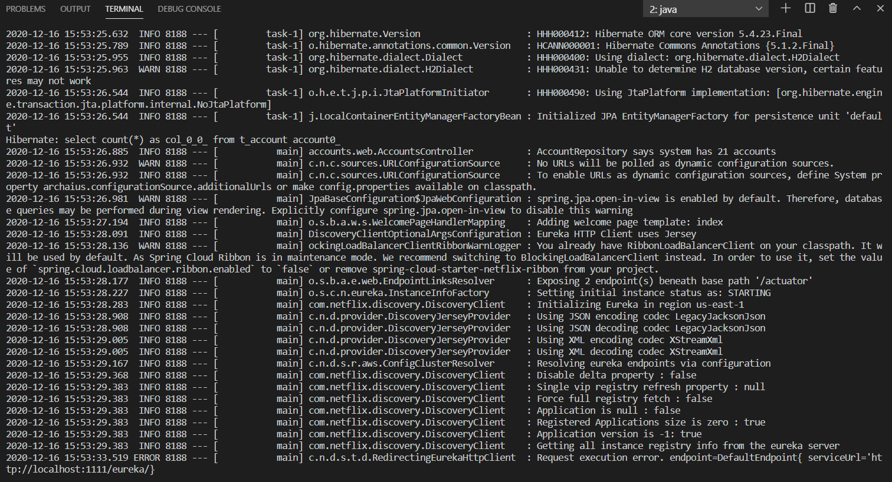
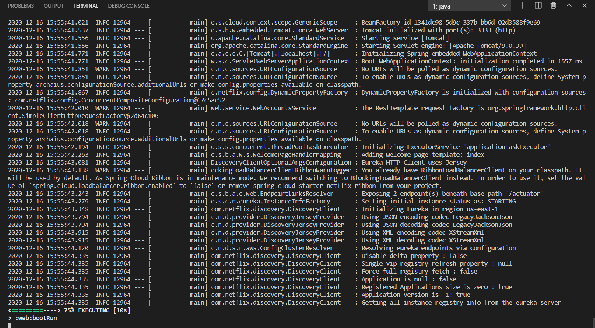
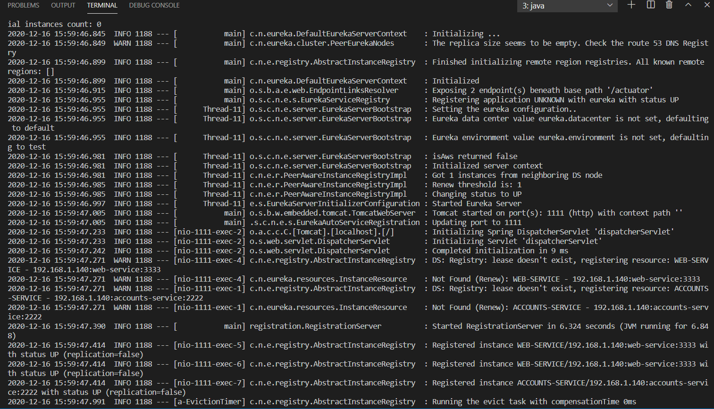
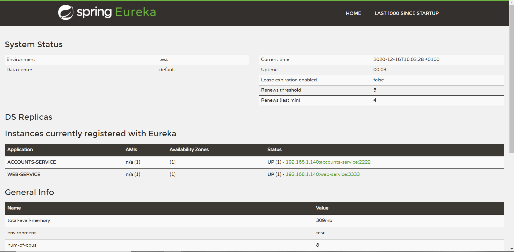
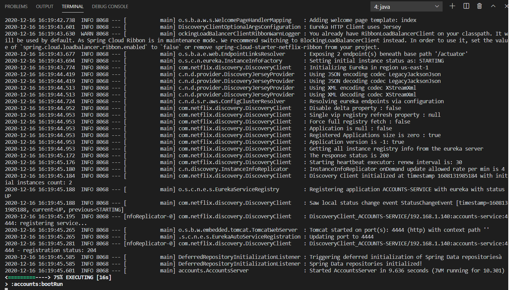

In the following is shown how the diferent objectives of the 6th laboratory have been completed:
* The two microservices are running and registered (two terminals, logs screenshots).
    * Accounts - port 2222 **gradle :accounts:bootRun**
    
    * Web - port 3333 **gradle :web:bootRun**
    

* The service registration service has the two microservices registered (a third terminal, dashboard screenshots)
    * registation terminal **gradle :registration:bootRun**
    
    * DashBoard **http://localhost:1111/**
    

* A second account microservice is running in the port 4444 and it is registered (a fourth terminal, log screenshots).
    * New account microservice - **changing propertires:port to 4444**
    
    * New dashboard info
    

* What happens when you kill the microservice with port 2222. Can the web service provide information about the accounts? Why?
    * Terminating the process on port 2222 (CTRL+C) makes registation notice that accounts on the port 2222 is down. If we go to eureka dashboard we will see that there still an accounts process but only the one on port 4444 instead of the two that were before.

------------------------------
para ver como y donde arranca todo -> fichero aplication 
para arrancar -> gradle :web:bootRun    (puerto 3333)
                 servidor eureka -> gradle :registration:bootRun (puerto 1111)
                 account service -> gradle :accounts:bootRun    (puerto 2222)

¿Que pasa si tiramos una maquina de backend, y la abrimos en otra terminal?
- La nueva instancia se registrara en eureka
- Se lo comunicara al front end para que cambie a quien se dirije